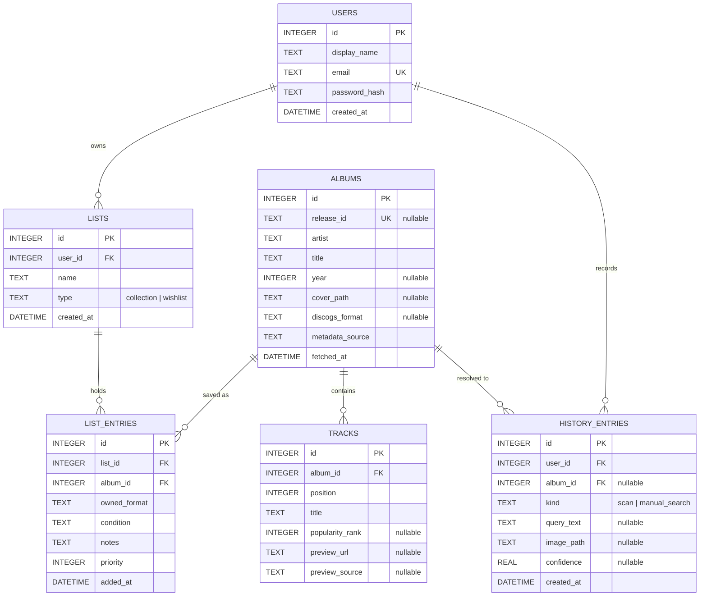

# S1-06: initial album data model

> As a developer, I want an initial album data model so that recognition
> results can be represented consistently.

The model is implemented with [Drift](https://drift.simonbinder.eu/) over
SQLite, the local-storage stack named in the project README. Source files:

| Purpose | File |
| --- | --- |
| Table definitions | `mobile/lib/data/local/tables.dart` |
| Database and migration | `mobile/lib/data/local/app_database.dart` |
| Album and track access | `mobile/lib/data/local/daos/album_dao.dart` |
| List and duplicate access | `mobile/lib/data/local/daos/list_dao.dart` |
| Sample data | `mobile/lib/data/local/seed_data.dart` |
| Tests | `mobile/test/data/album_data_model_test.dart` |

The editable diagram is [`jamscan_ERdiagram.drawio`](jamscan_ERdiagram.drawio),
openable with [draw.io](https://app.diagrams.net/).

## Entity relationship diagram



## Team decisions

### 1. Synthetic integer primary key, Discogs id as a unique attribute

`albums.id` is an autoincrementing integer; the Discogs identifier is stored
separately in `albums.release_id` with a unique index and may be null.

A manual entry or an unrecognised scan has no Discogs identifier, so the
Discogs id cannot be the primary key. Keeping it as a unique attribute still
prevents the same release from being stored twice, and foreign keys in
`tracks`, `list_entries`, and `history_entries` stay narrow integers.

`AlbumDao.saveAlbumWithTracks` uses this rule: when an album with the same
`release_id` already exists, the row is updated and its tracklist replaced
rather than inserted again.

### 2. Duplicate rule: one album per list

`list_entries` has a unique key on `(list_id, album_id)`.

The team agreed the rule as "unique `(list_id, release_id)`". It is enforced on
`album_id` because that is the foreign key actually stored in the row, and
`albums.release_id` is itself unique, so the two are equivalent for any album
that has a Discogs identifier. Enforcing it on `album_id` additionally covers
manually added albums, which have no `release_id`.

The same album may appear in a collection and in a wishlist, since those are
two different lists.

Call `ListDao.addAlbumToListIfAbsent` from the UI: it returns `null` for a
duplicate so the screen can show a message. `ListDao.addAlbumToList` inserts
directly and lets the database reject a duplicate with an exception.

### 3. Delete behaviour: cascade

Deleting a row removes the rows that cannot exist without it:

| Parent | Child | Behaviour |
| --- | --- | --- |
| `albums` | `tracks` | cascade |
| `albums` | `list_entries` | cascade |
| `lists` | `list_entries` | cascade |
| `users` | `lists` | cascade |
| `users` | `history_entries` | cascade |
| `albums` | `history_entries` | set null |

A tracklist and a saved entry have no meaning without their album, so cascade
avoids orphaned rows and extra cleanup code. History is the exception: a scan
the user performed still happened even if the album is later removed, so
`history_entries.album_id` is set to null instead of deleting the record.

SQLite only enforces foreign keys when they are switched on per connection, so
`AppDatabase.migration` runs `PRAGMA foreign_keys = ON` in `beforeOpen`.

### 4. Cover images on disk, path stored in the database

`albums.cover_path` holds a path, not image bytes.

Cover art is large and binary. Storing it in SQLite inflates the database file,
slows queries that do not need the image, and complicates backups. Writing the
file to application storage and keeping a path keeps rows small and lets the
image be loaded lazily by the UI. A null path means no cover has been
downloaded yet.

## Nullability note

The diagram marks only `release_id`, `album_id` in history, and the preview and
query columns as nullable. In the implementation `year`, `cover_path`,
`discogs_format`, `popularity_rank`, and `preview_source` are also nullable,
because a scan or a manual entry can produce an album before those values are
known. Everything else is `NOT NULL`.

## Generated code

Drift generates `*.g.dart` files next to the sources. They are committed so
that `flutter analyze` and `flutter test` work in CI without a code-generation
step. After changing a table or a DAO, run from `mobile/`:

```bash
dart run build_runner build
dart format lib test
```

Any change to a table also needs `schemaVersion` to be raised and a migration
added in `AppDatabase.migration`, once the app ships with real user data.

## Sample data

`insertSeedData` creates one user, a collection, a wishlist, and five albums
with tracklists, three of which are saved into the lists. It is used by the
tests and can be called from a development build to populate an empty database.

## Validation

From `mobile/`:

```bash
flutter pub get
dart run build_runner build
dart format lib test
flutter analyze
flutter test
flutter build apk --debug
```

The tests cover storing and reloading an album with its tracks, re-saving the
same release, rejection of a duplicate list entry, cascade on album delete,
cascade on user delete, and the seed data.
